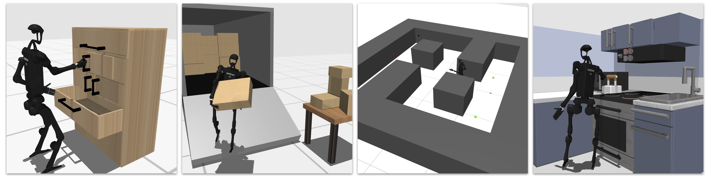

# HumanoidBench: Simulated Humanoid Benchmark for Whole-Body Locomotion and Manipulation

[Paper](https://arxiv.org/abs/2403.10506) [Website](https://sferrazza.cc/humanoidbench_site/)

We present [HumanoidBench](https://sferrazza.cc/humanoidbench_site/), a simulated humanoid robot benchmark consisting of $15$ whole-body manipulation and $12$ locomotion tasks. This repo contains the code for environments and training.



## Directories
Structure of the repository:
* `data`: Weights of the low-level skill policies
* `dreamerv3`: Training code for dreamerv3
* `humanoid_bench`: Core benchmark code
    * `assets`: Simulation assets
    * `envs`: Environment files
    * `mjx`: MuJoCo MJX training code
* `jaxrl_m`: Training code for SAC
* `ppo`: Training code for PPO
* `tdmpc2`: Training code for TD-MPC2

## Installation
Create a clean conda environment:
```
conda create -n humanoidbench python=3.11
conda activate humanoidbench
```
Then, install the required packages:
```
# Install HumanoidBench
pip install -e .

# jax GPU version
pip install "jax[cuda12]==0.4.28"
# Or, jax CPU version
pip install "jax[cpu]==0.4.28"

# Install jaxrl
pip install -r requirements_jaxrl.txt

# Install dreamer
pip install -r requirements_dreamer.txt

# Install td-mpc2
pip install -r requirements_tdmpc.txt
```


## Environments

### Main Benchmark Tasks
* `h1hand-walk-v0`
* `h1hand-reach-v0`
* `h1hand-hurdle-v0`
* `h1hand-crawl-v0`
* `h1hand-maze-v0`
* `h1hand-push-v0`
* `h1hand-cabinet-v0`
* `h1strong-highbar_hard-v0`  # Make hands stronger to be able to hang from the high bar
* `h1hand-door-v0`
* `h1hand-truck-v0`
* `h1hand-cube-v0`
* `h1hand-bookshelf_simple-v0`
* `h1hand-bookshelf_hard-v0`
* `h1hand-basketball-v0`
* `h1hand-window-v0`
* `h1hand-spoon-v0`
* `h1hand-kitchen-v0`
* `h1hand-package-v0`
* `h1hand-powerlift-v0`
* `h1hand-room-v0`
* `h1hand-stand-v0`
* `h1hand-run-v0`
* `h1hand-sit_simple-v0`
* `h1hand-sit_hard-v0`
* `h1hand-balance_simple-v0`
* `h1hand-balance_hard-v0`
* `h1hand-stair-v0`
* `h1hand-slide-v0`
* `h1hand-pole-v0`
* `h1hand-insert_normal-v0`
* `h1hand-insert_small-v0`

### Test Environments with Random Actions
```
python -m humanoid_bench.test_env --env h1hand-walk-v0
```

### Test Environments with Hierarchical Policy and Random Actions
```
# Define checkpoints to pre-trained low-level policy and obs normalization
export POLICY_PATH="data/reach_two_hands/torch_model.pt"
export MEAN_PATH="data/reach_two_hands/mean.npy"
export VAR_PATH="data/reach_two_hands/var.npy"

# Test the environment
python -m humanoid_bench.test_env --env h1hand-push-v0 --policy_path ${POLICY_PATH} --mean_path ${MEAN_PATH} --var_path ${VAR_PATH} --policy_type "reach_double_relative"
```

### Test Low-Level Reaching Policy (trained with MJX, testing on classical MuJoCo)
```
# One-hand reaching
python -m humanoid_bench.mjx.mjx_test --with_full_model 

# Two-hand reaching
python -m humanoid_bench.mjx.mjx_test --with_full_model --task=reach_two_hands --folder=./data/reach_two_hands
```

### Change Observations
As a default, the environment returns a privileged state of the environment (e.g., robot state + environment state). To get proprio, visual, and tactile sensing, set `obs_wrapper=True` and accordingly select the required sensors, e.g. `sensors="proprio,image,tactile"`. When using tactile sensing, make sure to use `h1touch` in place of `h1hand`.
Full test instruction:
```
python -m humanoid_bench.test_env --env h1touch-stand-v0 --obs_wrapper True --sensors "proprio,image,tactile"
```

### Other Environments
In addition to the main benchmark tasks listed above, you can run the following environements that feature the robot without hands:
* `h1-walk-v0`
* `h1-reach-v0`
* `h1-hurdle-v0`
* `h1-crawl-v0`
* `h1-maze-v0`
* `h1-push-v0`
* `h1-highbar_simple-v0`
* `h1-door-v0`
* `h1-truck-v0`
* `h1-basketball-v0`
* `h1-package-v0`
* `h1-stand-v0`
* `h1-run-v0`
* `h1-sit_simple-v0`
* `h1-sit_hard-v0`
* `h1-balance_simple-v0`
* `h1-balance_hard-v0`
* `h1-stair-v0`
* `h1-slide-v0`
* `h1-pole-v0`

The robot with low-dimensional hands:
* `h1simplehand-pole-v0`

And the Unitree G1 robot with three-finger hands:
* `g1-walk-v0`
* `g1-reach-v0`
* `g1-hurdle-v0`
* `g1-crawl-v0`
* `g1-maze-v0`
* `g1-push-v0`
* `g1-cabinet-v0`
* `g1-door-v0`
* `g1-truck-v0`
* `g1-cube-v0`
* `g1-bookshelf_simple-v0`
* `g1-bookshelf_hard-v0`
* `g1-basketball-v0`
* `g1-window-v0`
* `g1-spoon-v0`
* `g1-kitchen-v0`
* `g1-package-v0`
* `g1-powerlift-v0`
* `g1-room-v0`
* `g1-stand-v0`
* `g1-run-v0`
* `g1-sit_simple-v0`
* `g1-sit_hard-v0`
* `g1-balance_simple-v0`
* `g1-balance_hard-v0`
* `g1-stair-v0`
* `g1-slide-v0`
* `g1-pole-v0`
* `g1-insert_normal-v0`
* `g1-insert_small-v0`

## Training
```
# Define TASK
export TASK="h1hand-sit_simple-v0"

# Train TD-MPC2
python -m tdmpc2.train disable_wandb=False wandb_entity=[WANDB_ENTITY] exp_name=tdmpc task=humanoid_${TASK} seed=0

# Train DreamerV3
python -m embodied.agents.dreamerv3.train --configs humanoid_benchmark --run.wandb True --run.wandb_entity [WANDB_ENTITY] --method dreamer --logdir logs --task humanoid_${TASK} --seed 0

# Train SAC
python ./jaxrl_m/examples/mujoco/run_mujoco_sac.py --env_name ${TASK} --wandb_entity [WANDB_ENTITY] --seed 0

# Train PPO (not using MJX)
python ./ppo/run_sb3_ppo.py --env_name ${TASK} --wandb_entity [WANDB_ENTITY] --seed 0
```


## Training Hierarchical Policies
```
# Define TASK
export TASK="h1hand-push-v0"

# Define checkpoints to pre-trained low-level policy and obs normalization
export POLICY_PATH="data/reach_one_hand/torch_model.pt"
export MEAN_PATH="data/reach_one_hand/mean.npy"
export VAR_PATH="data/reach_one_hand/var.npy"

# Train TD-MPC2 with pre-trained low-level policy
python -m tdmpc2.train disable_wandb=False wandb_entity=[WANDB_ENTITY] exp_name=tdmpc task=humanoid_${TASK} seed=0 policy_path=${POLICY_PATH} mean_path=${MEAN_PATH} var_path=${VAR_PATH} policy_type="reach_single"

# Train DreamerV3 with pre-trained low-level policy
python -m embodied.agents.dreamerv3.train --configs humanoid_benchmark --run.wandb True --run.wandb_entity [WANDB_ENTITY] --method dreamer_${TASK}_hierarchical --logdir logs --env.humanoid.policy_path ${POLICY_PATH} --env.humanoid.mean_path ${MEAN_PATH} --env.humanoid.var_path ${VAR_PATH} --env.humanoid.policy_type="reach_single" --task humanoid_${TASK} --seed 0
```

## Paper Training Curves

Please find [here](https://github.com/carlosferrazza/humanoid-bench/tree/main/logs) json files including all the training curves, so that comparing with our baselines will not necessarily require re-running them in the future.

The json files follow this key structure: task -> method -> seed_X -> (million_steps or return). As an example to access the return sequence for one seed of the SAC run for the walk task, you can query the json data as `data['walk']['SAC']['seed_0']['return']`.


## Citation
If you find HumanoidBench useful for your research, please cite this work:
```
@article{sferrazza2024humanoidbench,
    title={HumanoidBench: Simulated Humanoid Benchmark for Whole-Body Locomotion and Manipulation},
    author={Carmelo Sferrazza and Dun-Ming Huang and Xingyu Lin and Youngwoon Lee and Pieter Abbeel},
    journal={arXiv Preprint arxiv:2403.10506},
    year={2024}
}
```


## References
This codebase contains some files adapted from other sources:
* jaxrl_m: https://github.com/dibyaghosh/jaxrl_m/tree/main
* DreamerV3: https://github.com/danijar/dreamerv3
* TD-MPC2: https://github.com/nicklashansen/tdmpc2
* purejaxrl (JAX-PPO traning): https://github.com/luchris429/purejaxrl/tree/main
* Digit models: https://github.com/adubredu/KinodynamicFabrics.jl/tree/sim
* Unitree H1 models: https://github.com/unitreerobotics/unitree_ros/tree/master
* MuJoCo Menagerie (Unitree H1, Shadow Hands, Robotiq 2F-85 models): https://github.com/google-deepmind/mujoco_menagerie
* Robosuite (some texture files): https://github.com/ARISE-Initiative/robosuite
